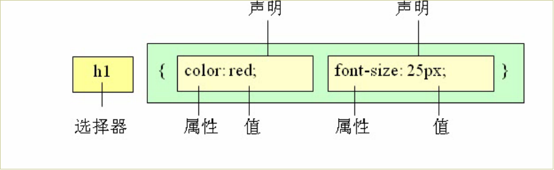

# CSS
***
**课程目标:**
* 学会使用CSS选择器
* 熟记CSS样式和外观属性
* 熟练掌握CSS各种选择器
* 熟练掌握CSS各种选择器
* 熟练掌握CSS三种显示模式
* 熟练掌握CSS背景属性
* 熟练掌握CSS三大特性
* 熟练掌握CSS盒子模型
* 熟练掌握CSS浮动
* 熟练掌握CSS定位
* 熟练掌握CSS高级技巧强化CSS

## 1.CSS初识

CSS(Cascading Style Sheets)

CSS通常称为CSS样式表或层叠样式表（级联样式表），主要用于设置HTML页面中的文本内容（字体、大小、对齐方式等）、图片的外形（宽高、边框样式、边距等）以及版面的布局等外观显示样式。

CSS以HTML为基础，提供了丰富的功能，如字体、颜色、背景的控制及整体排版等，而且还可以针对不同的浏览器设置不同的样式。

## 2.CSS样式规则

```css
<style type="text/css">
        标签名称{
            属性名称: 属性对应的值;
            ...
        }
</style>
```


使用HTML时，需要遵从一定的规范。CSS亦如此，要想熟练地使用CSS对网页进行修饰，首先需要了解CSS样式规则，具体格式如下：       


>>在上面的样式规则中:

>>1. 选择器用于指定CSS样式作用的HTML对象，花括号内是对该对象设置的具体样式。
>>2. 属性和属性值以“键值对”的形式出现。
>>3. 属性是对指定的对象设置的样式属性，例如字体大小、文本颜色等。
>>4. 属性和属性值之间用英文“:”连接。
>>5. 多个“键值对”之间用英文“;”进行区分。可以用段落 和 表格的对齐的演示。

## 3.CSS样式属性

### 3.1 文字属性

#### 3.1.1 font-size:字号大小

 font-size属性用于设置字号，该属性的值可以使用相对长度单位，也可以使用绝对长度单位。其中，相对长度单位比较常用，推荐使用像素单位px，绝对长度单位使用较少。具体如下：
 

 #### 3.1.2 font-family:字体

 font-family属性用于设置字体。网页中常用的字体有宋体、微软雅黑、黑体等，例如将网页中所有段落文本的字体设置为微软雅黑，可以使用如下CSS样式代码：

p{ font-family:"微软雅黑";}

可以同时指定多个字体，中间以逗号隔开，表示如果浏览器不支持第一个字体，则会尝试下一个，直到找到合适的字体。

>>常用技巧：
>> 1. 现在网页中普遍使用14px+。
>> 2. 尽量使用偶数的数字字号。ie6等老式浏览器支持奇数会有bug。
>> 3. 各种字体之间必须使用英文状态下的逗号隔开。
>> 4. 中文字体需要加英文状态下的引号，英文字体一般不需要加引号。当需要设置英文字体时，英文字体名必须位于中文字体名之前。
>> 5. 如果字体名中包含空格、#、$等符号，则该字体必须加英文状态下的单引号或双引号，例如font-family: "Times New Roman";。
>> 6. 尽量使用系统默认字体，保证在任何用户的浏览器中都能正确显示。
>> 7. 在企业开发中最常见的字体有以下几个
中文: 宋体/黑体/微软雅黑
英文: "Times New Roman"/Arial

#### 3.1.3 CSS Unicode字体
在 CSS 中设置字体名称，直接写中文是可以的。但是在文件编码（GB2312、UTF-8 等）不匹配时会产生乱码的错误。xp 系统不支持 类似微软雅黑的中文。

>>方案一： 你可以使用英文来替代。 比如 font-family:"Microsoft Yahei"。

>>方案二： 在 CSS 直接使用 Unicode 编码来写字体名称可以避免这些错误。使用 Unicode 写中文字体名称，浏览器是可以正确的解析的。

| 字体名称    | 英文名称        | Unicode 编码         |
| ----------- | --------------- | -------------------- |
| 宋体        | SimSun          | \5B8B\4F53           |
| 新宋体      | NSimSun         | \65B0\5B8B\4F53      |
| 黑体        | SimHei          | \9ED1\4F53           |
| 微软雅黑    | Microsoft YaHei | \5FAE\8F6F\96C5\9ED1 |
| 楷体_GB2312 | KaiTi_GB2312    | \6977\4F53_GB2312    |
| 隶书        | LiSu            | \96B6\4E66           |
| 幼园        | YouYuan         | \5E7C\5706           |
| 华文细黑    | STXihei         | \534E\6587\7EC6\9ED1 |
| 细明体      | MingLiU         | \7EC6\660E\4F53      |
| 新细明体    | PMingLiU        | \65B0\7EC6\660E\4F53 |

#### 3.1.4 CSS  font-weight:字体粗细

字体加粗除了用 b  和 strong 标签之外，可以使用CSS 来实现，但是CSS 是没有语义的。

```html
font-weight属性用于定义字体的粗细，其可用属性值：normal、bold、bolder、lighter、100~900（100的整数倍）。
```

#### 3.1.5 font-style:字体风格

字体倾斜除了用 i  和 em 标签之外，可以使用CSS 来实现，但是CSS 是没有语义的。

font-style属性用于定义字体风格，如设置斜体、倾斜或正常字体，其可用属性值如下：

- normal：默认值，浏览器会显示标准的字体样式。

- italic：浏览器会显示斜体的字体样式。

- oblique：浏览器会显示倾斜的字体样式。

小技巧： 

 
>>平时我们很少给文字加斜体，反而喜欢给斜体标签（em，i）改为普通模式。
 

#### 3.1.6 font:综合设置字体样式

缩写格式:
```html
font: style weight size family;
例如:
font:italic bold 10px "楷体";
```

>> 注意点:
>> 1. 在这种缩写格式中有的属性值可以省略
>>    1. sytle可以省略
>>    2. weight可以省略
>> 2. 在这种缩写格式中style和weight的位置可以交换
>> 3. 在这种缩写格式中有的属性值是不可以省略的
>>    1. size不能省略
>>    2. family不能省略
>> 4. size和family的位置是不能顺便乱放的
>>    1. size一定要写在family的前面, 而且size和family必须写在所有属性的最后

#### 3.1.7 文本属性设置

**1. 文本装饰的属性**
- 格式:text-decoration: underline;
- 取值:
- underline 下划线
- line-through 删除线
- overline 上划线
- none 什么都没有, 最常见的用途就是用于去掉超链接的下划线

**2. 文本水平对齐的属性**
- 格式: text-align: right;
- 取值:
- left 左
- right 右
- center 中

**3. 文本首行缩进的属性**
- 格式: text-indent: 2em;
- 取值:
- 2em, 其中em是单位, 一个em代表缩进一个文字的宽度

**4. 文本字间距的属性**
>>letter-spacing:字间距

- letter-spacing属性用于定义字间距，所谓字间距就是字符与字符之间的空白。其属性值可为不同单位的数值，允许使用负值，默认为normal。

>>word-spacing:单词间距

- word-spacing属性用于定义英文单词之间的间距，对中文字符无效。和letter-spacing一样，其属性值可为不同单位的数值，允许使用负值，默认为normal。

>>word-spacing和letter-spacing均可对英文进行设置。不同的是letter-spacing定义的为字母之间的间距，而word-spacing定义的为英文单词之间的间距。

**文字阴影(CSS3)**
以后我们可以给我们的文字添加阴影效果了  Shadow  影子  

```css
text-shadow:水平位置 垂直位置 模糊距离 阴影颜色;
```


## 4.选择器

### 4.1 标签选择器（元素选择器）

标签选择器是指用HTML标签名称作为选择器，按标签名称分类，为页面中某一类标签指定统一的CSS样式。其基本语法格式如下：
``` css
标签名称{
    属性:值;
}
```

>>注意点:
>>1. 标签选择器选中的是当前界面中所有的标签, 而不能单独选中某一个标签
>>2. 标签选择器无论标签藏得多深都能选中
>>3. 只要是HTML中的标签就可以作为标签选择器(h/a/img/ul/ol/dl/input....)

### 4.2 类选择器

作用: 根据指定的类名称找到对应的标签, 然后设置属性

格式:
```html
.类名{
    属性:值;
}
```

>>注意点:
>>1. 每个HTML标签都有一个属性叫做class, 也就是说每个标签都可以设置类名
>>2. 在同一个界面中class的名称是可以重复的
>>3. 在编写class选择器时一定要在class名称前面加上.
>>4. 类名的命名规范和id名称的命名规范一样
>>5. 类名就是专门用来给CSS设置样式的
>>6. 在HTML中每个标签可以同时绑定多个类名
>>7. 格式: <标签名称 class="类名1 类名2 ...">

### 4.3 id选择器

id选择器使用“#”进行标识，后面紧跟id名，其基本语法格式如下：

```
#id名{属性1:属性值1; 属性2:属性值2; 属性3:属性值3; }
```

该语法中，id名即为HTML元素的id属性值，大多数HTML元素都可以定义id属性，元素的id值是唯一的，只能对应于文档中某一个具体的元素。

用法基本和类选择器相同。

### 4.4 id选择器和类选择器

W3C标准规定，在同一个页面内，不允许有相同名字的id对象出现，但是允许相同名字的class。

1. id和class的区别?
   1. id相当于人的身份证不可以重复
    class相当于人的名称可以重复
   2. 一个HTML标签只能绑定一个id名称
    一个HTML标签可以绑定多个class名称 

2. id选择器和class选择器区别?
id选择器是以#开头
class选择器是以.开头

3. 在企业开发中到底用id选择器还是用class选择器?
id一般情况下是给js使用的, 所以除非特殊情况, 否则不要使用id去设置样式

4. 在企业开发中一个开发人员对类的使用可以看出这个开发人员的技术水平
一般情况下在企业开发中要注重冗余代码的抽取, 可以将一些公共的代码抽取到一个类选择器中, 然后让标签和这个类选择器绑定即可

### 4.5 伪类选择器

伪类选择器用于向某些选择器添加特殊的效果。比如给链接添加特殊效果， 比如可以选择 第1个，第n个元素。

```css
为了和我们刚才学的类选择器相区别，  类选择器是一个点 比如 .demo {}   而我们的伪类 用 2个点 就是 冒号  比如  :link{}
```

#### 4.5.1  链接伪类选择器

- :link      /* 未访问的链接 */
- :visited   /* 已访问的链接 */
- :hover     /* 鼠标移动到链接上 */
- :active    /* 选定的链接 */

```css
a {   /* a是标签选择器  所有的链接 */
        font-weight: 700;
        font-size: 16px;
        color: gray;
}
a:hover {   /* :hover 是链接伪类选择器 鼠标经过 */
		color: red; /*  鼠标经过的时候，由原来的 灰色 变成了红色 */
}
```

#### 4.5.2 结构(位置)伪类选择器（CSS3)

- :first-child :选取属于其父元素的首个子元素的指定选择器
- :last-child :选取属于其父元素的最后一个子元素的指定选择器
- :nth-child(n) ： 匹配属于其父元素的第 N 个子元素，不论元素的类型
- :nth-last-child(n) ：选择器匹配属于其元素的第 N 个子元素的每个元素，不论元素的类型，从最后一个子元素开始计数。
  n 可以是数字、关键词或公式
```css
li:first-child { /*  选择第一个孩子 */
        		color: pink; 
        	}
li:last-child {   /* 最后一个孩子 */
        		color: purple;
        	}
li:nth-child(4) {   /* 选择第4个孩子  n  代表 第几个的意思 */ 
				color: skyblue;
        	}
```
#### 4.5.3 目标伪类选择器(CSS3)

 :target目标伪类选择器 :选择器可用于选取当前活动的目标元素

```css
:target {
		color: red;
		font-size: 30px;
}
```
## 4.引入CSS样式表

### 4.1 行内式（内联样式）

```css
<标签名 style="属性1:属性值1; 属性2:属性值2; 属性3:属性值3;"> 内容 </标签名>
```

>>语法中style是标签的属性，实际上任何HTML标签都拥有style属性，用来设置行内式。其中属性和值的书写规范与CSS样式规则相同，行内式只对其所在的标签及嵌套在其中的子标签起作用。

### 4.2 内部样式表（内嵌式）
```html
<head>
<style type="text/CSS">
    选择器 {属性1:属性值1; 属性2:属性值2; 属性3:属性值3;}
</style>
</head>
```

### 4.3 外部样式表（外链式）
```html
<head>
  <link href="CSS文件的路径" type="text/CSS" rel="stylesheet" />
</head>
```
该语法中，link标签需要放在head头部标签中，并且必须指定link标签的三个属性，具体如下：
>>href：定义所链接外部样式表文件的URL，可以是相对路径，也可以是绝对路径。
type：定义所链接文档的类型，在这里需要指定为“text/CSS”，表示链接的外部文件为CSS样式表。
rel：定义当前文档与被链接文档之间的关系，在这里需要指定为“stylesheet”，表示被链接的文档是一个样式表文件。

### 4.4 三种样式表总结

| 样式表   | 优点           | 缺点           | 使用情况    | 控制范围      |
| ----- | ------------ | ------------ | ------- | --------- |
| 行内样式表 | 书写方便，权重高     | 没有实现样式和结构相分离 | 较少      | 控制一个标签（少） |
| 内嵌样式表 | 部分结构和样式相分离   | 没有彻底分离       | 较多      | 控制一个页面（中） |
| 外部样式表 | 完全实现结构和样式相分离 | 需要引入         | 最多，强烈推荐 | 控制整个站点（多） |

## 5.标签显示模式

### 5.1 块级元素(block-level)
每个块元素通常都会独自占据一整行或多整行，可以对其设置宽度、高度、对齐等属性，常用于网页布局和网页结构的搭建。
```html
常见的块元素有<h1>~<h6>、<p>、<div>、<ul>、<ol>、<li>等，其中<div>标签是最典型的块元素。
```

* 块级元素的特点：

    * （1）总是从新行开始

    * （2）高度，行高、外边距以及内边距都可以控制。

    * （3）宽度默认是容器的100%

    * （4）可以容纳内联元素和其他块元素。

### 5.2 行内元素(inline-level)
行内元素（内联元素）不占有独立的区域，仅仅靠自身的字体大小和图像尺寸来支撑结构，一般不可以设置宽度、高度、对齐等属性，常用于控制页面中文本的样式。

```html
常见的行内元素有<a>、<strong>、<b>、<em>、<i>、<del>、<s>、<ins>、<u>、<span>等，其中<span>标签最典型的行内元素。
```

* 行内元素的特点：

    * （1）和相邻行内元素在一行上。

    * （2）高、宽无效，但水平方向的padding和margin可以设置，垂直方向的无效。

    * （3）默认宽度就是它本身内容的宽度。

    * （4）行内元素只能容纳文本或则其他行内元素。（a特殊）

**注意：**

1. 只有 文字才 能组成段落  因此 p  里面不能放块级元素，同理还有这些标签h1,h2,h3,h4,h5,h6,dt，他们都是文字类块级标签，里面不能放其他块级元素。
2. 链接里面不能再放链接。

### 5.3 块级元素和行内元素区别

>>块级元素的特点：
（1）总是从新行开始
（2）高度，行高、外边距以及内边距都可以控制。
（3）宽度默认是容器的100%
（4）可以容纳内联元素和其他块元素。

>>行内元素的特点：
（1）和相邻行内元素在一行上。
（2）高、宽无效，但水平方向的padding和margin可以设置，垂直方向的无效。
（3）默认宽度就是它本身内容的宽度。
（4）行内元素只能容纳文本或则其他行内元素。

### 5.4 行内块元素（inline-block）
```html
在行内元素中有几个特殊的标签——、<input />、<td>，可以对它们设置宽高和对齐属性，有些资料可能会称它们为行内块元素。
```

行内块元素的特点：
（1）和相邻行内元素（行内块）在一行上,但是之间会有空白缝隙。
（2）默认宽度就是它本身内容的宽度。
（3）高度，行高、外边距以及内边距都可以控制。

## 6.CSS复合选择器
复合选择器是由两个或多个基础选择器，通过不同的方式组合而成的,目的是为了可以选择更准确更精细的目标元素标签。

### 6.1 交集选择器

交集选择器由两个选择器构成，其中第一个为标签选择器，第二个为class选择器，两个选择器之间不能有空格，如h3.special。


### 6.2 并集选择器

>并集选择器（CSS选择器分组）是各个选择器通过<strong style="color:#f00">逗号</strong>连接而成的，任何形式的选择器（包括标签选择器、class类选择器id选择器等），都可以作为并集选择器的一部分。如果某些选择器定义的样式完全相同，或部分相同，就可以利用并集选择器为它们定义相同的CSS样式。


### 6.3 后代选择器

>后代选择器又称为包含选择器，用来选择元素或元素组的后代，其写法就是把外层标签写在前面，内层标签写在后面，中间用空格分隔。当标签发生嵌套时，内层标签就成为外层标签的后代。


### 6.4 子元素选择器

>子元素选择器只能选择作为某元素子元素的元素。其写法就是把父级标签写在前面，子级标签写在后面，中间跟一个 &gt; 进行连接，注意，符号左右两侧各保留一个空格。


### 6.5 属性选择器

| **选择器**                  | **含义**                 |
| ------------------------ | -------------------- |
| **E[attr]**          | 存在attr属性即可           |
| **E[attr=val]**     | 属性值完全等于val           |
| **E[attr\*=val]**    | 属性值里包含val字符并且在“任意”位置 |
| **E[attr^=val]**     | 属性值里包含val字符并且在“开始”位置 |
| **E[attr$=val]**     | 属性值里包含val字符并且在“结束”位置 |

**伪元素选择器（CSS3)**

1. E::first-letter文本的第一个单词或字（如中文、日文、韩文等）
2. E::first-line 文本第一行；
3. E::selection 可改变选中文本的样式；
```html
p::first-letter {
  font-size: 20px;
  color: hotpink;
}

/* 首行特殊样式 */
p::first-line {
  color: skyblue;
}

p::selection {
  /* font-size: 50px; */
  color: orange;
}
```
4. E::before和E::after

在E元素内部的开始位置和结束位创建一个元素，该元素为行内元素，且必须要结合content属性使用。

```css
div::befor {
  content:"开始";
}
div::after {
  content:"结束";
}
```


E:after、E:before 在旧版本里是伪元素，CSS3的规范里“:”用来表示伪类，“::”用来表示伪元素，但是在高版本浏览器下E:after、E:before会被自动识别为E::after、E::before，这样做的目的是用来做兼容处理。

E:after、E:before后面的练习中会反复用到，目前只需要有个大致了解

":" 与 "::" 区别在于区分伪类和伪元素

## 7.CSS 背景(background)
CSS 可以添加背景颜色和背景图片，以及来进行图片设置。

| background-color                      | 背景颜色     |
| ------------------------------------- | -------- |
| background-image                      | 背景图片地址   |
| background-repeat                     | 是否平铺     |
| background-position                   | 背景位置     |
| background-attachment                 | 背景固定还是滚动 |
| 背景的合写（复合属性）                           |          |
| background:背景颜色 背景图片地址 背景平铺 背景滚动 背景位置 |          |

>>背景的合写（复合属性）background:背景颜色 背景图片地址 背景平铺 背景滚动 背景位置

### 7.1 背景图片(image)

语法： 

```css
background-image : none | url (url) 
```

参数： 

- none : 　无背景图（默认的）
- url : 　使用绝对或相对地址指定背景图像 

background-image 属性允许指定一个图片展示在背景中（只有CSS3才可以多背景）可以和 background-color 连用。 如果图片不重复地话，图片覆盖不到地地方都会被背景色填充。 如果有背景图片平铺，则会覆盖背景颜色。

小技巧：  我们提倡 背景图片后面的地址，url不要加引号。

### 7.2 背景平铺（repeat）
语法： 

```css
background-repeat : repeat | no-repeat | repeat-x | repeat-y 
```

参数： 

- repeat : 　背景图像在纵向和横向上平铺（默认的）

- no-repeat : 　背景图像不平铺

- repeat-x : 　背景图像在横向上平铺

- repeat-y : 　背景图像在纵向平铺 

- 设置背景图片时，默认把图片在水平和垂直方向平铺以铺满整个元素。

- repeat-x : 　背景图像在横向上平铺  


repeat-y : 　背景图像在纵向平铺 


### 7.3 背景位置(position)

语法： 

```css
background-position : length || length

background-position : position || position 

```

参数： 

length : 　百分数 | 由浮点数字和单位标识符组成的长度值。请参阅长度单位 
position : 　top | center | bottom | left | center | right 

说明： 

设置或检索对象的背景图像位置。必须先指定background-image属性。默认值为：(0% 0%)。
如果只指定了一个值，该值将用于横坐标。纵坐标将默认为50%。第二个值将用于纵坐标。

>注意：

>1. position 后面是x坐标和y坐标。 可以使用方位名词或者 精确单位。
>2. 如果和精确单位和方位名字混合使用，则必须是x坐标在前，y坐标后面。比如 

>>background-position: 15px top;   则 15px 一定是  x坐标   top是 y坐标。

实际工作用的最多的，就是背景图片居中对齐了。

### 7.4 背景附着

语法： 

```css
background-attachment : scroll | fixed 
```

参数： 

scroll : 　背景图像是随对象内容滚动
fixed : 　背景图像固定 

说明： 

设置或检索背景图像是随对象内容滚动还是固定的。

### 7.5 背景简写
background属性的值的书写顺序官方并没有强制标准的。为了可读性，建议大家如下写：

background:背景颜色 背景图片地址 背景平铺 背景滚动 背景位置
```css
background: transparent url(image.jpg) repeat-y  scroll 50% 0 ;
```
### 7.6 背景透明(CSS3)

CSS3支持背景半透明的写法语法格式是:

```css
background: rgba(0,0,0,0.3);
```

 最后一个参数是alpha 透明度  取值范围 0~1之间

 注意：  背景半透明是指盒子背景半透明， 盒子里面的内容不收影响。

同样， 可以给 文字和边框透明  都是 rgba 的格式来写。

```css
color:rgba(0,0,0,0.3);
border: 1px solid rgba(0,0,0,0.3);
```
### 7.7 背景缩放(CSS3)

通过background-size设置背景图片的尺寸，就像我们设置img的尺寸一样，在移动Web开发中做屏幕适配应用非常广泛。

其参数设置如下：

a) 可以设置长度单位(px)或百分比（设置百分比时，参照盒子的宽高）

b) 设置为cover时，会自动调整缩放比例，保证图片始终填充满背景区域，如有溢出部分则会被隐藏。

c) 设置为contain会自动调整缩放比例，保证图片始终完整显示在背景区域。

```css
background-image: url('images/gyt.jpg');
			background-size: 300px 100px;
			/* background-size: contain; */
			/* background-size: cover; */
```

### 7.8 多背景(CSS3)

以逗号分隔可以设置多背景，可用于自适应布局

```css
background-image: url('images/gyt.jpg'),url('images/robot.png');
```

## 8.CSS 三大特性
***
层叠 继承  优先级 是我们学习CSS 必须掌握的三个特性。

### 8.1 CSS层叠性

所谓层叠性是指多种CSS样式的叠加。

是浏览器处理冲突的一个能力,如果一个属性通过两个选择器设置到同一个元素上，那么这个时候一个属性就会将另一个属性层叠掉

比如先给某个标签指定了内部文字颜色为红色，接着又指定了颜色为蓝色，此时出现一个标签指定了相同样式不同值的情况，这就是样式冲突。

一般情况下，如果出现样式冲突，则会按照CSS书写的顺序，以最后的样式为准。

### 8.2 CSS继承性

所谓继承性是指书写CSS样式表时，子标签会继承父标签的某些样式，如文本颜色和字号。想要设置一个可继承的属性，只需将它应用于父元素即可。

简单的理解就是：  子承父业。

>注意:恰当地使用继承可以简化代码，降低CSS样式的复杂性。子元素可以继承父元素的样式（text-，font-，line-这些元素开头的都可以继承，以及color属性）

### 8.3 CSS优先级

定义CSS样式时，经常出现两个或更多规则应用在同一元素上，这时就会出现优先级的问题。

在考虑权重时，初学者还需要注意一些特殊的情况，具体如下：

```
继承样式的权重为0。即在嵌套结构中，不管父元素样式的权重多大，被子元素继承时，他的权重都为0，也就是说子元素定义的样式会覆盖继承来的样式。

行内样式优先。应用style属性的元素，其行内样式的权重非常高，可以理解为远大于100。总之，他拥有比上面提高的选择器都大的优先级。

权重相同时，CSS遵循就近原则。也就是说靠近元素的样式具有最大的优先级，或者说排在最后的样式优先级最大。

CSS定义了一个!important命令，该命令被赋予最大的优先级。也就是说不管权重如何以及样式位置的远近，!important都具有最大优先级。
```

### 8.4 CSS特殊性（Specificity）

关于CSS权重，我们需要一套计算公式来去计算，这个就是 CSS Specificity，我们称为CSS 特性或称非凡性，它是一个衡量CSS值优先级的一个标准 具体规范入如下：

specificity用一个四位的数 字串(CSS2是三位)来表示，更像四个级别，值从左到右，左面的最大，一级大于一级，数位之间没有进制，级别之间不可超越。 
| 继承或者* 的贡献值      | 0,0,0,0 |
| --------------- | ------- |
| 每个元素（标签）贡献值为    | 0,0,0,1 |
| 每个类，伪类贡献值为      | 0,0,1,0 |
| 每个ID贡献值为        | 0,1,0,0 |
| 每个行内样式贡献值       | 1,0,0,0 |
| 每个!important贡献值 | ∞ 无穷大   |

 比如的例子：

 ~~~
div ul  li   ------>      0,0,0,3

.nav ul li   ------>      0,0,1,2

a:hover      -----—>      0,0,1,1

.nav a       ------>      0,0,1,1   

#nav p       ----->       0,1,0,1
 ~~~

​          

 >注意： 数位之间没有进制 比如说： 0,0,0,5 + 0,0,0,5 =0,0,0,10 而不是 0,0, 1, 0， 所以不会存在10个div能赶上一个类选择器的情况。

总结优先级：

1. 使用了 !important声明的规则。
2. 内嵌在 HTML 元素的 style属性里面的声明。
3. 使用了 ID 选择器的规则。
4. 使用了类选择器、属性选择器、伪元素和伪类选择器的规则。
5. 使用了元素选择器的规则。
6. 只包含一个通用选择器的规则。

~~~
总结：权重是优先级的算法，层叠是优先级的表现
~~~