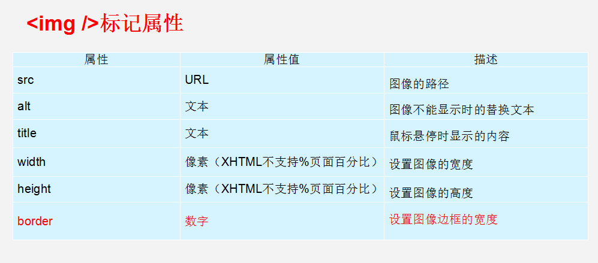
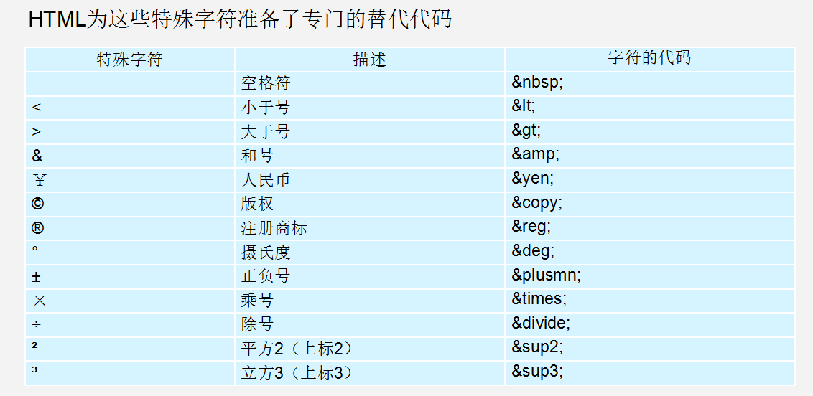

# HTML学习

* 学习目标
  - 了解常用浏览器
  - 掌握WEB标准
  - 理解标签语义化
  - 掌握常用的排版标签
  - 掌握常用的文本格式化图像链等标签
  - 掌握三种列表标签
  - 掌握表格标签
  - 掌握表格标签
  - 掌握表单标签
  - 掌握H5新增表单和表单属性

---

[TOC]


## 1.认识网页
---
网页主要由文字、图像和超链接等元素构成。当然，除了这些元素，网页中还可以包含音频、视频以及Flash等。

### 1.1常见浏览器介绍
---
浏览器是网页运行的平台，常用的浏览器有IE、火狐（Firefox）、谷歌（Chrome）、Safari和Opera等。我们平时称为五大浏览器。

#### 1.1.1常见浏览器内核
---
浏览器内核又可以分成两部分：**渲染引擎**(layout engineer 或者 Rendering Engine)和 **JS 引擎**。
渲染引擎 它负责取得网页的内容（HTML、XML、图像等等）、整理讯息（例如加入 CSS 等），以及计算网页的显示方式，然后会输出至显示器或打印机。浏览器的内核的不同对于网页的语法解释会有不同，所以渲染的效果也不相同。
JS 引擎 则是解析 Javascript 语言，执行 javascript语言来实现网页的动态效果。

最开始渲染引擎和 JS 引擎并没有区分的很明确，后来 JS 引擎越来越独立，内核就倾向于只指渲染引擎。有一个网页标准计划小组制作了一个 ACID 来测试引擎的兼容性和性能。内核的种类很多，如加上没什么人使用的非商业的免费内核，可能会有10多种，但是常见的浏览器内核可以分这四种：**Trident**、**Gecko**、**Blink**、**Webkit**。
* （1）**Trident(IE内核)** 
    *   国内很多的双核浏览器的其中一核便是 **Trident**，美其名曰 **"兼容模式"**。

    * 代表： IE、傲游、世界之窗浏览器、Avant、腾讯TT、猎豹安全浏览器、360极速浏览器、百度浏览器等。

    * Window10 发布后，IE 将其内置浏览器命名为 Edge，Edge 最显著的特点就是新内核 **EdgeHTML**。
* （2）**Gecko(firefox)**

    * Gecko(Firefox 内核)： Mozilla FireFox(火狐浏览器) 采用该内核，Gecko 的特点是代码完全公开，因此，其可开发程度很高，全世界的程序员都可以为其编写代码，增加功能。 可惜这几年已经没落了， 比如 打开速度慢、升级频繁、猪一样的队友flash、神一样的对手chrome。
*  （3） **webkit(Safari)**
    * Safari 是苹果公司开发的浏览器，所用浏览器内核的名称是大名鼎鼎的 WebKit。

    * 现在很多人错误地把 webkit 叫做 chrome内核（即使 chrome内核已经是 blink 了），苹果感觉像被别人抢了媳妇，都哭晕再厕所里面了。

    * 代表浏览器：傲游浏览器3、 Apple Safari (Win/Mac/iPhone/iPad)、Symbian手机浏览器、Android 默认浏览器。

* （4） **Chromium/Bink(chrome)**
    * 在 Chromium 项目中研发 Blink 渲染引擎（即浏览器核心），内置于 Chrome 浏览器之中。Blink 其实是 WebKit 的分支。
    * 大部分国产浏览器最新版都采用Blink内核。
* （5） **Presto(Opera)** 

    * Presto 是挪威产浏览器 opera 的 "前任" 内核，为何说是 "前任"，因为最新的 opera 浏览器早已将之抛弃从而投入到了谷歌怀抱了。

    ###### 移动端的浏览器内核主要说的是系统内置浏览器的内核。
    ###### 目前移动设备浏览器上常用的内核有 Webkit，Blink，Trident，Gecko 等，其中 iPhone 和 iPad 等苹果 iOS 平台主要是 WebKit，Android 4.4 之前的 Android 系统浏览器内核是 WebKit，Android4.4 系统浏览器切换到了Chromium，内核是 Webkit 的分支 Blink，Windows Phone 8 系统浏览器内核是 Trident。
### 1.2 Web标准
---
通过以上浏览器的内核不同，我们知道他们工作原理、解析肯定不同，显示就会有差别。
#### 1.2.1 Web 标准的好处
1. 让Web的发展前景更广阔 
1. 内容能被更广泛的设备访问
1. 更容易被搜寻引擎搜索
1. 降低网站流量费用
1. 使网站更易于维护
1. 提高页面浏览速度

#### 1.2.2 Web 标准构成
* 结构标准：
    * 结构用于对网页元素进行整理和分类，主要包括XML和XHTML两个部分。
* 样式标准：
    * 表现用于设置网页元素的版式、颜色、大小等外观样式，主要指的是CSS。
* 行为标准：
    * 行为是指网页模型的定义及交互的编写，主要包括DOM和ECMAScript两个部分


## 2 HTML初识
> HTML（英文Hyper Text Markup Language的缩写）中文译为“超文本标签语言”，主要是通过HTML标签对网页中的文本、图片、声音等内容进行描述。
### 2.1 HTML骨架格式 html
``` html
<HTML>   
    <head>     
        <title></title>
    </head>
    <body>
    </body>
</HTML>

```
### 2.2 HTML标签分类
---
 在HTML页面中，带有“< >”符号的元素被称为HTML标签，如上面提到的 &lt;HTML&gt;、&lt;head&gt;、&lt;body&gt;都是HTML标签。所谓标签就是放在“< >” 标签符中表示某个功能的编码命令，也称为HTML标签或 HTML元素
 ###### 1.双标签
 > <标签名> 内容 </标签名>
  ###### 2.单标签
  > <标签名 />

### 2.3 HTML标签关系
 ###### 1.嵌套关系（父子）
 ``` html
 <head>  <title> </title>  </head>
 ```
  ###### 1.并列关系（兄弟）
 ``` html
 <head> </head>
 <body> </body>
 ```

### 2.4 文档类型
  ``` html 
  <!DOCTYPE html>
  ```
* 这句话就是告诉我们使用哪个html版本？  我们使用的是 html 5 的版本。  html有很多版本，那我们应该告诉用户和浏览器我们使用的版本号。

* <!DOCTYPE> 标签位于文档的最前面，用于向浏览器说明当前文档使用哪种 HTML 或 XHTML 标准规范，必需在开头处使用<!DOCTYPE>标签为所有的XHTML文档指定XHTML版本和类型，只有这样浏览器才能按指定的文档类型进行解析。

>>**注意：**  一些老网站可能用的还是老版本的文档类型比如 XHTML之类的，但是我们学的是HTML5,而且HTML5的文档类型兼容很好(向下兼容的原则)，所以大家放心的使用HTML5的文档类型就好了。
### 2.5 字符集
***
``` html
 <meta charset="UTF-8">
```
 * utf-8是目前最常用的字符集编码方式，常用的字符集编码方式还有gbk和gb2312。

* gb2312 简单中文  包括6763个汉字

* BIG5   繁体中文 港澳台等用

* GBK包含全部中文字符    是GB2312的扩展，加入对繁体字的支持，兼容GB2312

* UTF-8则包含全世界所有国家需要用到的字符

### 2.6 标签语义化

**根据W3C对于标签的定义来使用标签**

#### 2.6.1 为什么要有语义化标签

1. 方便代码的阅读和维护
2. 同时让浏览器或是网络爬虫可以很好地解析，从而更好分析其中的内容 
3. 使用语义化标签会具有更好地搜索引擎优化 

核心：合适的地方给一个最为合理的标签。

>>语义是否良好： 当我们去掉CSS之后，网页结构依然组织有序，并且有良好的可读性。


>>不管是谁都能看懂这块内容是什么。

>>遵循的原则：先确定语义的HTML ，再选合适的CSS。

## 3.HTML标签

首先 HTML和CSS是两种完全不同的语言，我们学的是结构，就只写HTML标签，认识标签就可以了。 不会再给结构标签指定样式了。

HTML标签有很多，这里我们学习最为常用的，后面有些较少用的，我们可以查下手册就可以了。 

[W3C](http://www.w3school.com.cn/)

### 3.1 排版标签

排版标签主要和css搭配使用，显示网页结构的标签，是网页布局最常用的标签。

#### 3.1.1 标题标签

``` html
 <h1>、<h2>、<h3>、<h4>、<h5>、<h6>
```
 ==标题标签语义：  作为标题使用，并且依据重要性递减==
#### 3.1.2 段落标签
 单词缩写：  paragraph  段落
 ``` html
 <p>hello</p>
 ```
#### 3.1.3 水平线标签
  单词缩写：  horizontal  横线
``` html
<hr />
```
#### 3.1.4 换行标签
单词缩写：  break   打断 ,换行
``` html
<br />
```
#### 3.1.5 div span标签
div  span    是没有语义的     是用于网页布局
div 就是  division  的缩写   分割， 分区
span, 跨度，跨距；范围    
``` html
<div> 这是头部 </div>    <span>今日价格</span>
```
#### 3.1.6 文本格式化标签
在网页中，有时需要为文字设置粗体、斜体或下划线效果，这时就需要用到HTML中的文本格式化标签，使文字以特殊的方式显示。
|标签| 显示效果|
|------------ | -------------|
|b标签、strong标签|文字以粗体方式显示（XHTML推荐使用strong）|
|i标签、em标签 | 文字以斜体方式显示（XHTML推荐使用em）|
|s标签、del标签|文字以加删除线的方式显示（XHTML推荐使用del）|
|u标签和ins标签|文字以加下划线的方式显示（XHTML不赞成使用u）|

### 3.2 标签属性
使用HTML制作网页时，如果想让HTML标签提供更多的信息，可以使用HTML标签的属性加以设置。其基本语法格式如下：
```html
<标签名 属性1="属性值1" 属性2="属性值2" …> 内容 </标签名>
```
#### 3.2.1 图像标签img
img标签中的img其实是英文image的缩写,所以img标签的作用, 就是告诉浏览器我们需要显示一张图片.

img标签格式:
```html

```
其实img标签中的src是英文source的缩写
所以img标签中的src就是用来告诉img标签, 需要显示的图片的位置

title: 用于告诉浏览器, 当鼠标悬停在图片上时, 需要弹出的描述框中显示什么内容

alt其实是英文alternate的缩写, 它的作用就是用于告诉浏览器, 当需要显示的图片找不到时显示什么内容


==注意点==
- 和H系列标签/p标签还有Hr标签不一样, img标签不会独占一行
- 如果我们手动指定了img标签显示的图片的宽度和高度, 有可能会导致图片变形, 那么如果又想指定宽度和高度, 又不想让图片变形. 我们可以只指定宽度和高度其中的一个值即可
- 只要指定了高度, 系统会自动根据高度计算出宽度, 只要指定了宽度, 系统会自动根据宽度计算出高度, 并且都是等比拉伸的, 也就是说不会变形

#### 3.2.2 a标签
单词缩写：  anchor 的缩写 。基本解释 锚, 铁锚 的

``` html 
<a href="跳转目标" target="目标窗口的弹出方式">文本或图像</a>
```
**href**：用于指定链接目标的url地址，当为标签应用href属性时，它就具有了超链接的功能。  Hypertext Reference的缩写。意思是超文本引用

**target**：这个属性的作用就是专门用于控制如何跳转
* _self: 用于在当前选项卡中跳转, 也就是不新建界面跳转. 默认就是_self
* _blank: 用于在新的选项卡中跳转, 也就是新建界面跳转

>>
注意点:
1. a标签不仅可以让文字可以点击, 还可以让图片也能够被点击
1. 一个a标签必须有一个href属性, 否则a标签不知道要跳转到什么地方
1. 如果通过a标签的href属性指定一个URL地址, 那么必须在地址前面加上http://或https://
1. a标签的href属性除了可以指定一个网络地址以外, 还可以指定一个本地地址
<<

#### 3.2.3 base 标签
base标签就是专门用来统一的指定当前网页中所有的超链接(a标签)需要如何打开。

注意点:
1. base标签必须写在head标签的开始标签和结束标签之间
1. 如果既在base中指定了target又在a标签中指定了target,那么浏览器会按照a标签中指定的来执行

#### 3.2.4 锚点定位

```html
1.使用“a href=”#id名>“链接文本"</a>创建链接文本。

2.使用相应的id名标注跳转目标的位置。
```
>>
注意点:
1. 通过我们的a标签跳转到指定的位置, 是没有过度动画的, 是直接一下子就跳转到了指定位置
1. a标签除了可以跳转到当前界面的指定位置以外, 还可以在跳转到其它界面的时候直接跳转到其它界面的指定位置
<<

格式:
``` html
<a href="13-锚点测试界面.html#bottom" target="_blank">跳转到锚点测试界面</a>
<h2 id="bottom">我是锚点测试界面33333</h2>
```
#### 3.2.5 特殊字符标签


#### 3.2.6 列表
列表标签的作用: 给一堆数据添加列表语义, 也就是告诉搜索引擎告诉浏览器这一堆数据是一个整体

* HTML中列表标签的分类
    * 无序列表(最多)(unordered list)
        ```html
        <ul>
        <li>列表项1</li>
        <li>列表项2</li>
        <li>列表项3</li>
        ......
        </ul>
        ```
        给一堆数据添加列表语义, 并且这一堆数据中所有的数据都没有先后之分

    * 有序列表(最少)(ordered list)
        ``` html
        <ul>
            <li>需要显示的条目内容</li>
        </ul>
        ```
        * li其实是英文list item的缩写。
        * list是列表的意思。
        * item是条目的意思。
        * 所以结合起来就是,列表条目的意思。

    * 定义列表(其次)(definition list)
        定义列表常用于对术语或名词进行解释和描述，定义列表的列表项前没有任何项目符号。其基本语法如下：
        ```html
        <dl>
        <dt>名词1</dt>
        <dd>名词1解释1</dd>
        <dd>名词1解释2</dd>
        ...
        <dt>名词2</dt>
        <dd>名词2解释1</dd>
        <dd>名词2解释2</dd>
        ...
        </dl>
        ```

>>
注意点:
1. 一定要记住ul标签是用来给一堆数据添加列表语义的, 而不是用来给他们添加小圆点的。
2. ul标签和li标签是一个整体, 是一个组合. 所以一般情况下ul标签和li标签都是一起出现, 不会单个出现. 也就是说不会单独使用一个ul标签或者单独使用一个li 标签, 都是结合在一起使用。
3. 由于ul标签和li标签是一个组合, 所以ul标签中不推荐包含其它标签, 也就是说以后你在ul标签中只会看到li标签。
<<

#### 3.2.6 表格 table
---
**表格标签作用: 用来给一堆数据添加表格语义**
其实表格是一种数据的展现形式, 当数据量非常大的时候, 表格这种展现形式被认为是最为清晰的一种展现形式
表格标签格式:
```html
<table>
    <tr>
        <td>需要显示的内容</td>
    </tr>
</table>
```
* table代表整个表格, 也就是一堆table标签就是一个表格
* tr标签代表整个表格中的一行数据, 也就是说一对tr标签就是表格中的一行
* td标签代表表格中一行中的一个单元格, 也就是说一对td标签就是一行中的一个单元格

>>注意点
表格标签有一个边框属性, 这个属性决定了边框的宽度. 默认情况下这个属性的值是0, 所以看不到边框
表格标签和列表标签一样, 它是一个组合标签, 所以table/tr/td要么一起出现, 要么一起不出现, 不会单个出现

##### 3.2.6.1 表格属性


>>1. 宽度和高度的属性
可以给table标签和td标签使用。
    1. 表格的宽度和高度默认是按照内容的尺寸来调整的, 也可以通过给table标签设置width/height属性的方式来手动指定表格的宽度和高度
    2. 如果给td标签设置widht/height属性, 会修改当前单元格的宽度和高度, 不会影响整个表格的宽度和高度
>>2. 水平对齐和垂直对齐的属性
其中水平对齐可以给table标签和tr标签和td标签使用;
垂直对齐只能给tr标签和td标签使用
    1. 给table标签设置align属性, 可以控制表格在水平方向的对齐方式
    2. 给tr标签设置align属性, 可以控制当前行中所有单元格内容的水平方向的对齐方式
    3. 给td标签设置align属性, 可以控制当前单元格中内容在说方向的对齐方式
>>注意点: 如果td中设置了align属性, tr中也设置了align属性, 那么单元格中的内容会按照td中设置的来对齐
>>1. 给tr标签设置valign属性, 可以控制当前行中所有单元格中的内容, 在垂直方向的对齐方式
>>1. 给td标签设置valign属性, 可以控制当前单元格中的内容在垂直方向的对齐方式
注意点:  如果td中设置了valign属性, tr中也设置了valign属性, 那么单元格中的内容会按照td中设置的来对齐
>>3. 外边距和内边距的属性
只能给table标签使用
    1. 外边距就是单元格和单元格之间的距离, 我们称之为外边距,默认情况下单元格和单元格之间的外边距的距离是2px
    1. 内边距就是单元格的边框和文字之间的间隙, 我们称之为内边距,默认情况下内边距是1.
>>注意: 以上讲解的内容仅仅作为了解, 以后在企业开发中所有控制样式的都是通过CSS
##### 3.2.6.2 表头标签

表头一般位于表格的第一行或第一列，其文本加粗居中，如下图所示，即为设置了表头的表格。设置表头非常简单，只需用表头标签&lt;th&gt;&lt;/th&gt;替代相应的单元格标签&lt;td&gt;&lt;/td&gt;即可。

##### 3.2.6.3 表格结构

1. 由于表格中存储的数据比较复杂, 为了方便管理和阅读以及提升语义, 我们可以对表格中存储的数据进行分类
表格中存储的数据可以分为4类
    1. 表格的标题
    2. 表格的表头信息
    3. 表格的主体信息
    4. 表格的页尾信息

```html
<table>
    <caption>表格的标题</caption>
    <thead>
        <tr>
            <th>每一列的标题</th>
        </tr>
    </thead>
    <tbody>
        <tr>
            <td>数据</td>
        </tr>
    </tbody>
    <tfoot>
        <tr>
            <td>数据</td>
        </tr>
    </tfoot>
</table>
```
caption作用: 指定表格的标题
thead作用: 指定表格的表头信息
tbody作用: 指定表格的主体信息
tfoot作用: 指定表格的附加信息

>>注意点:
>>* 如果我们没有编写tbody, 系统会系统给我们添加tbody
>>* 如果指定了thead和tfoot, 那么在修改整个表格的高度时, thead和tfoot有自己默认的高度, 不会随着表格的高度变化而变化

##### 3.2.6.4 合并单元格

跨行合并：rowspan    跨列合并：colspan

合并单元格的思想：

​     将多个内容合并的时候，就会有多余的东西，把它删除。    例如 把 3个 td 合并成一个， 那就多余了2个，需要删除。

>  公式：  删除的个数  =  合并的个数  - 1   

##### 3.2.6.5 细线表格
在表格标签中想通过指定外边距为0来实现细线表格是不靠谱的, 其实它是将2条线合并为了一条线, 所以看上去很不舒服.

细线表格的制作方式:
1. 给table标签设置bgcolor
2. 给tr标签设置bgcolor
3. 给table标签设置cellspacing = "1px"

>>注意点:
table标签和tr标签以及td标签都支持bgcolor属性
但是以上内容仅仅作为了解, 因为样式以后都是通过css来控制

#### 3.2.7 表单标签

目的是为了收集用户信息。

 * 表单控件：
    * 包含了具体的表单功能项，如单行文本输入框、密码输入框、复选框、提交按钮、重置按钮等。

 * 提示信息：
    * 一个表单中通常还需要包含一些说明性的文字，提示用户进行填写和操作。

 * 表单域：  
     * 他相当于一个容器，用来容纳所有的表单控件和提示信息，可以通过他定义处理表单数据所用程序的url地址，以及数据提交到服务器的方法。如果不定义表单域，表单中的数据就无法传送到后台服务器。

```html
<form>
    <表单元素>
</form>
```

**input控件**
在上面的语法中，&lt;input /&gt;标签为单标签，type属性为其最基本的属性，其取值有多种，用于指定不同的控件类型。除了type属性之外，&lt;input /&gt;标签还可以定义很多其他的属性，其常用属性如下表所示。


**label标签**

label 标签为 input 元素定义标注（标签）。

作用：  用于绑定一个表单元素, 当点击label标签的时候, 被绑定的表单元素就会获得输入焦点

for 属性规定 label 与哪个表单元素绑定。

```html
<label for="male">Male</label>
<input type="radio" name="sex" id="male" value="male">
```

**textarea控件(文本域)**

如果需要输入大量的信息，就需要用到&lt;textarea&gt;&lt;/textarea&gt;标签。通过textarea控件可以轻松地创建多行文本输入框，其基本语法格式如下：

```html
<textarea cols="每行中的字符数" rows="显示的行数">
  文本内容
</textarea>
```

**下拉菜单**
使用select控件定义下拉菜单的基本语法格式如下

```html
<select>
  <option>选项1</option>
  <option>选项2</option>
  <option>选项3</option>
  ...
</select>
```

>>注意：
>>1. &lt;select&gt;</select&gt;中至少应包含一对&lt;option></option&gt;。
>>2. 在option 中定义selected =" selected "时，当前项即为默认选中项。

**表单域**

在HTML中，form标签被用于定义表单域，即创建一个表单，以实现用户信息的收集和传递，form中的所有内容都会被提交给服务器。创建表单的基本语法格式如下：

```html
<form action="url地址" method="提交方式" name="表单名称">
  各种表单控件
</form>
```

常用属性：

1. Action
   在表单收集到信息后，需要将信息传递给服务器进行处理，action属性用于指定接收并处理表单数据的服务器程序的url地址。
2. method
   用于设置表单数据的提交方式，其取值为get或post。
3. name
   用于指定表单的名称，以区分同一个页面中的多个表单。

>>注意：  每个表单都应该有自己表单域。

#### 3.2.8 HTML5新标签与特性

**文档类型设定**
- document
  - HTML:
  - XHTML:
  - HTML5

**字符设定**
- <meta http-equiv="charset" content="utf-8">：HTML与XHTML中建议这样去写
- <meta charset="utf-8">：HTML5的标签中建议这样去写

**常用新标签**
- header：定义文档的页眉
- nav：定义导航链接的部分
- footer：定义文档或节的页脚
- article：标签规定独立的自包含内容
- section：定义文档中的节（section、区段）
- aside：定义其所处内容之外的内容

**常用新属性**

| **属性**|**用法**| **含义**                                |
| -------------------- | :--------------------------------------------: | ------------------------------------------- |
| **placeholder**| <input type="text" placeholder="请输入用户名"&gt; | 占位符提供可描述输入字段预期值的提示信息    |
| **autofocus**|         <input type="text" autofocus&gt;          | 规定当页面加载时 input 元素应该自动获得焦点 |
| **multiple**|          <input type="file" multiple&gt;          | 多文件上传                                  |
| **autocomplete**|     <input type="text" autocomplete="off"&gt;     | 规定表单是否应该启用自动完成功能            |
| **required**|          <input type="text" required&gt;          | 必填项                                      |
| **accesskey**|       <input type="text" accesskey="s"&gt;        | 规定激活（使元素获得焦点）元素的快捷键      |


**新增的type属性值：**

| **类型**       | **使用示例**            | **含义** |
| ---------------- | ----------------------- | ---------- |
| **email******    | <input type="email"&gt;    | 输入邮箱格式     |
| **tel******      | <input type="tel"&gt;      | 输入手机号码格式   |
| **url******      | <input type="url"&gt;      | 输入url格式    |
| **number******   | <input type="number"&gt;   | 输入数字格式     |
| **search******   | <input type="search"&gt;   | 搜索框（体现语义化） |
| **range******    | <input type="range"&gt;    | 自由拖动滑块     |
| **time******     | <input type="time"&gt;     |            |
| **date******     | <input type="date"&gt;     |可以通过日历来选择日期 |
| **datetime****** | <input type="datetime"&gt; |可以通过日历来选择日期和时间|
| **month******    | <input type="month"&gt;    |可以通过日历来选择月份|
| **week******     | <input type="week"&gt;     |可以通过日历来选择周|


#### 3.2.8 video标签

格式:
```html
<video src="">
</video>
```

- video标签的属性
- src: 用于告诉video标签需要播放的视频地址
- autoplay: 用于告诉video标签是否需要自动播放视频
- controls: 用于告诉video标签是否需要显示控制条
- poster: 用于告诉video标签视频没有播放之前显示的占位图片
- loop: 一般用于做广告视频, 用于告诉video标签视频播放完毕之后是否需要循环播放
- preload: 预加载视频, 但是需要注意preload和autoplay相冲, 如果设置了autoplay属性, 那么preload属性就会失效
- muted:静音
- width/height: 和img标签中的一模一样

```html
<video>
    <source src="" type=""></source>
    <source src="" type=""></source>
</video>
```

**第二种格式存在的意义:**
- 由于视频数据非常非常的重要, 所以五大浏览器厂商都不愿意支持别人的视频格式, 所以导致了没有一种视频格式是所有浏览器都支持的这个时候W3C为了解决这个问题, 所以推出了第二个video标签的格式

- video标签的第二种格式存在的意义就是为了解决浏览器适配问题
- video 元素支持三种视频格式, 我们可以把这三种格式都通过source标签指定给video标签, 那么以后当浏览器播放视频时它就会从这三种中选择一种自己支持的格式来播放

注意点:
1. 当前通过video标签的第二种格式虽然能够指定所有浏览器都支持的视频格式, 但是想让所有浏览器都通过video标签播放视频还有一个前提条件, 就是浏览器必须支持HTML5标签, 否则同样无法播放
2. 在过去的一些浏览器是不支持HTML5标签的, 所以为了让过去的一些浏览器也能够通过video标签来播放视频, 那么我们以后可以通过一个JS的框架叫做html5media来实现


#### 3.2.9 audio标签

格式:
```html
<audio src="">
</audio>

<audio>
    <source src="" type="">
</audio>
```

>>注意点:
audio标签的使用和video标签的使用基本一样, video中能够使用的属性在audio标签中大部分都能够使用, 并且功能都一样
只不过有3个属性不能用, height/width/poster


#### 3.3.0 详情和概要标签

>>作用:利用summary标签来描述概要信息, 利用details标签来描述详情信息
默认情况下是折叠展示, 想看见详情必须点击


格式:
```html
<details>
    <summary>概要信息</summary>
    详情信息
</details>
```

